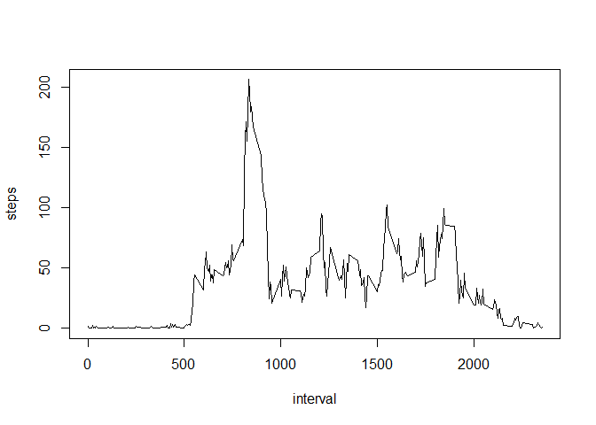

# Reproducible Research: Peer Assessment 1


## Loading and preprocessing the data

```r
originalData <- read.csv("activity.csv")
summary(originalData)
```

```
##      steps                date          interval     
##  Min.   :  0.00   2012-10-01:  288   Min.   :   0.0  
##  1st Qu.:  0.00   2012-10-02:  288   1st Qu.: 588.8  
##  Median :  0.00   2012-10-03:  288   Median :1177.5  
##  Mean   : 37.38   2012-10-04:  288   Mean   :1177.5  
##  3rd Qu.: 12.00   2012-10-05:  288   3rd Qu.:1766.2  
##  Max.   :806.00   2012-10-06:  288   Max.   :2355.0  
##  NA's   :2304     (Other)   :15840
```

```r
head(originalData)
```

```
##   steps       date interval
## 1    NA 2012-10-01        0
## 2    NA 2012-10-01        5
## 3    NA 2012-10-01       10
## 4    NA 2012-10-01       15
## 5    NA 2012-10-01       20
## 6    NA 2012-10-01       25
```

```r
data <- originalData[!is.na(originalData$steps),]
head(data)
```

```
##     steps       date interval
## 289     0 2012-10-02        0
## 290     0 2012-10-02        5
## 291     0 2012-10-02       10
## 292     0 2012-10-02       15
## 293     0 2012-10-02       20
## 294     0 2012-10-02       25
```


## What is mean total number of steps taken per day?

```r
totalStepsByDay <- aggregate(data$steps, by=list(data$date), FUN=sum)
colnames(totalStepsByDay) <- c("date", "steps")
head(totalStepsByDay)
```

```
##         date steps
## 1 2012-10-02   126
## 2 2012-10-03 11352
## 3 2012-10-04 12116
## 4 2012-10-05 13294
## 5 2012-10-06 15420
## 6 2012-10-07 11015
```

```r
hist(totalStepsByDay$steps)
```

 

```r
mean(totalStepsByDay$steps)
```

```
## [1] 10766.19
```


## What is the average daily activity pattern?

```r
meanStepsByInterval <- aggregate(data$steps, by=list(data$interval), FUN=mean)
colnames(meanStepsByInterval) <- c("interval", "steps")
head(meanStepsByInterval)
```

```
##   interval     steps
## 1        0 1.7169811
## 2        5 0.3396226
## 3       10 0.1320755
## 4       15 0.1509434
## 5       20 0.0754717
## 6       25 2.0943396
```

```r
plot(meanStepsByInterval, type = "l")
```

 


## Imputing missing values

```r
sum(is.na(originalData))
```

```
## [1] 2304
```

```r
filledData <- originalData
filledData[is.na(originalData$steps),]$steps <- mean(meanStepsByInterval$steps)

totalStepsByDayFilled <- aggregate(filledData$steps, by=list(filledData$date), FUN=sum)
colnames(totalStepsByDayFilled) <- c("date", "steps")
head(totalStepsByDayFilled)
```

```
##         date    steps
## 1 2012-10-01 10766.19
## 2 2012-10-02   126.00
## 3 2012-10-03 11352.00
## 4 2012-10-04 12116.00
## 5 2012-10-05 13294.00
## 6 2012-10-06 15420.00
```

```r
hist(totalStepsByDayFilled$steps)
```

 

```r
mean(totalStepsByDayFilled$steps)
```

```
## [1] 10766.19
```

```r
median(totalStepsByDayFilled$steps)
```

```
## [1] 10766.19
```


## Are there differences in activity patterns between weekdays and weekends?

```r
library(ggplot2)  
filledData["weekDay"] <- weekdays(as.Date(filledData$date, "%Y-%m-%d"))
filledData["weekEnd"] <- "Weekday"
filledData[filledData$weekDay == "Saturday" | filledData$weekDay == "Sunday", ]$weekEnd <- "Weekend" 
meanStepsByWeekEndWeekDay <- aggregate(filledData$steps, by=list(filledData$interval, filledData$weekEnd), FUN=mean)
colnames(meanStepsByWeekEndWeekDay) <- c("interval", "weekEnd", "steps")
qplot(interval, steps, data = meanStepsByWeekEndWeekDay, facets = .~weekEnd, ylab = "Emissions", xlab = "Year")
```

 

